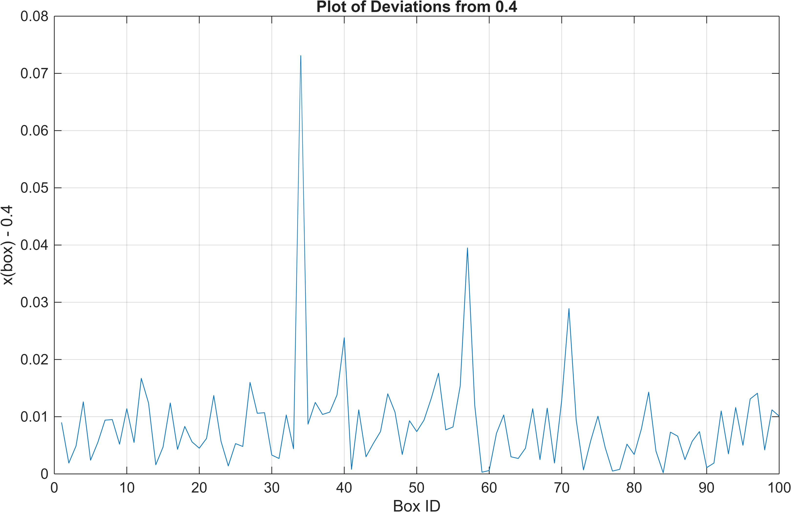

# Reinforcement Learning for Automated Package Sorting

[](https://www.python.org/downloads/)
[](https://numpy.org/)
[](https://matplotlib.org/)

This repository contains the implementation of a Reinforcement Learning (RL) agent for controlling an automated material handling system (AMS). The agent is trained using **Proximal Policy Optimization (PPO)** to sort packages of varying sizes to designated exit points on a 5x5 grid of actuated conveyor modules.

The project demonstrates the viability of modern RL techniques for solving complex industrial control problems characterized by high-dimensional action spaces and dynamic environmental interactions. A key component of this work is a **curriculum learning** strategy, which trains the agent on progressively harder tasks to achieve robust and efficient performance.

---

## 🚀 Showcase & Demos

### Center Sorting Performance
The fully trained agent successfully learns to sort packages and route them to the correct exit lane (middle of platform).

<!-- You should create a GIF of your simulation and replace the URL below -->

*<p align="center">Demonstration of the trained agent sorting packages succesfully.</p>*

### Accuracy of the Sorting Policy
The plot below shows the deviation of each box from its target exit position over 100 simulated runs. The agent consistently guides the vast majority of boxes to the center with minimal error, demonstrating an effective and reliable sorting policy.


*<p align="center">Figure: Deviation of box x-positions from their target at the conveyor exit.</p>*

---

### Final Sorting Performance
The fully trained agent successfully learns to differentiate packages by size and route them to the correct exit lane (small packages to the right, large packages to the left).

<!-- You should create a GIF of your simulation and replace the URL below -->

*<p align="center">Demonstration of the trained agent sorting packages of different sizes.</p>*

### Accuracy of the Sorting Policy
The plot below shows the deviation of each box from its target exit position over 100 simulated runs. The agent consistently guides the vast majority of boxes to the correct location with minimal error, demonstrating an effective and reliable sorting policy.


*<p align="center">Figure: Deviation of box x-positions from their target at the conveyor exit.</p>*

---

## 🔧 How It Works

### 1. The Environment: Automated Material System (AMS)
The simulation environment consists of:
-   A **5x5 grid** of independently controlled conveyor modules.
-   Each module's action is defined by a **rotation angle** and **actuation velocity**.
-   Packages of two different sizes (small and large) are generated in pairs at the entry of the grid.
-   A physics engine handles package movement and **collision detection/resolution**.

The sorting objective is to route packages based on their size:
-   **Small Packages** (`diameter < 0.225m`) should exit at `x ≈ 0.2m`.
-   **Large Packages** (`diameter ≥ 0.225m`) should exit at `x ≈ 0.6m`.

### 2. The RL Agent: Proximal Policy Optimization (PPO)
We use the PPO algorithm, an on-policy, actor-critic method ideal for continuous action spaces.
-   **Actor Network:** Decides the next action (module rotation and velocity).
-   **Critic Network:** Estimates the value of the current state, helping to stabilize training.
-   **Observation Space:** The agent receives a 60-dimensional state vector describing up to 10 packages, including their position, size, velocity, and distance to their target lane.

### 3. Reward Function Design
A carefully designed reward function was crucial for guiding the agent. The total reward is a combination of four components:

$$
R_{\text{total}} = R_{\text{alignment}} + R_{\text{exit}} - R_{\text{gap}} + R_{\text{forward}}
$$

Where:
-   **`R_alignment`**: Rewards the agent for moving packages into their correct target lane.
-   **`R_exit`**: Provides a large bonus for successfully exiting from the correct location.
-   **`R_gap`** (Penalty): Discourages packages from clustering too closely together to prevent collisions.
-   **`R_forward`**: Rewards the agent for maintaining throughput and continuous forward motion.

### 4. Curriculum Learning Strategy
To tackle the complexity of the task, the agent was trained using a curriculum learning approach, breaking the problem down into simpler, sequential stages:

1.  **Stage 1: Centered Sorting:** The agent first learns the basic mechanics of moving packages by training to guide all packages to a single exit point in the center. This establishes a baseline policy for stable system operation.
2.  **Stage 2: Sorting by Size:** Using the pre-trained model from Stage 1 as a starting point, the agent is then fine-tuned on the main task: sorting packages to different exits based on their size.
3.  **Refinement:** Throughout training, hyperparameters like the PPO clip factor and entropy bonus are scheduled to transition the agent from an exploratory to an exploitative policy, refining its behavior for higher accuracy.

---

## 💻 How to Run

### Dependencies
The project requires a standard Python environment with the following key libraries:
-   `numpy`
-   `matplotlib`
-   A custom simulation environment file (e.g., `ams_env.py`) where the AMS logic is defined.
-   An RL library or framework (the implementation in the paper appears custom but could be adapted from libraries like `stable-baselines3` or a custom PyTorch/TensorFlow implementation).

### Instructions
1.  **Clone the repository:**
    ```bash
    git clone https://github.com/YOUR_USERNAME/YOUR_REPO.git
    cd YOUR_REPO
    ```
2.  **Install dependencies:**
    ```bash
    pip install numpy matplotlib
    # Add installation steps for your RL framework if applicable
    ```
3.  **Run the training script:**
    Execute the main Python script to start the training process.
    ```bash
    python train_ppo_sorter.py
    ```
    The script should handle the curriculum learning stages and save the trained model. A separate script can be used for evaluation and visualization.

---

## License
This project is licensed under a proprietary license. Please see the `LICENSE` file for details.

```text
Copyright (c) [Year] [Your Full Name]

All Rights Reserved.

Permission is hereby granted... [etc.]
